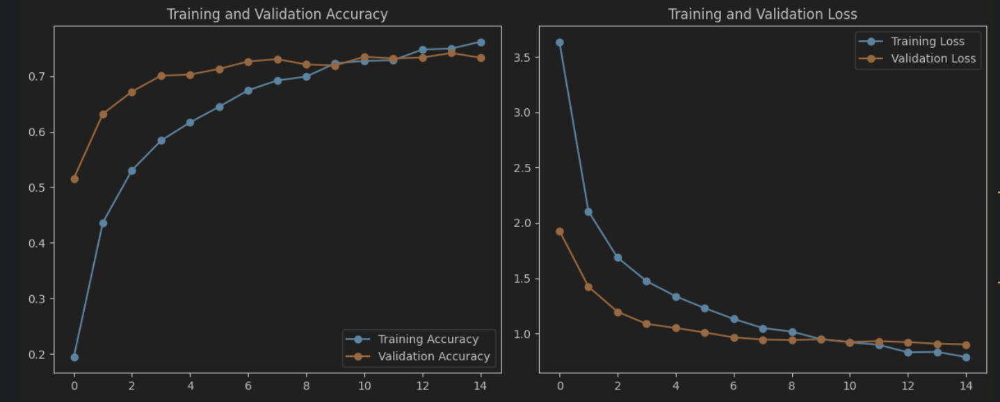

# 🐦 Bird Species Classification using CNNs

An AI-powered image classification project that identifies bird species from images using state-of-the-art deep learning architectures: ResNet101 and EfficientNetB0.

## 🎯 Features

- **Fine-Grained Image Classification** across 200 bird species
- **Ensemble Learning**: Improved accuracy by combining multiple models
- **ResNet101 + EfficientNetB0**: Transfer learning with pretrained models
- **Visual Performance**: Accuracy and loss curves for training evaluation
- **Command-line Inference**: Predict bird species from an image

## 🐤 Dataset Overview

- **Source**: Kaggle
- **Classes**: 200 bird species
- **Images**: Pre-split into `dataset/train` and `dataset/test` folders

## 📊 Model Performance

- **ResNet101 Accuracy**: ~80%
- **EfficientNetB0 Accuracy**: ~74%
- **Ensemble Accuracy**: Boosted by averaging predictions
- **Evaluation Metrics**: Accuracy, Precision, Recall, F1-Score

## 🧠 Deep Learning Models

### ✅ ResNet101
- Pretrained on ImageNet
- Custom classification head
- Frozen base layers during initial training

### ✅ EfficientNetB0
- Pretrained on ImageNet
- Custom classification head
- Lightweight and optimized

### ✅ Ensemble
- Averages softmax probabilities from ResNet and EfficientNet
- Improves robustness and performance

## 🖼️ Visualizations

Visual analysis of training:

- **Training/Validation Accuracy**
- **Training/Validation Loss**

Located under:
## 🖼️ Visualizations



## 🧪 Inference Script

Use `ensemble_inference.py` to make predictions on bird images.

```bash
python scripts/ensemble_inference.py <image_path>
```
### Example:
```bash
python scripts/ensemble_inference.py sample_bird.jpg
```

### Returns:
```
Predicted Bird Species: Scarlet_Tanager (Confidence: 0.92)
```

## 🗂️ Project Structure

```
bird_species_classifier/
│
├── models/
│   ├── resnet.py               # ResNet101 model architecture & training
│   ├── efficientnet.py         # EfficientNetB0 architecture & training
│
├── scripts/
│   ├── ensemble_inference.py   # Predict using both models (ensemble)
│   ├── visualization.py        # Plot curves, classification report
│
├── saved_models/
│   ├── resnet_model.h5
│   ├── efficientnet_model.h5
│
├── visualizations/
│   ├── visualization.png
│
├── dataset/
│   ├── train/                  # Training images (organized in subfolders)
│   ├── test/                   # Test images
│
├── requirements.txt
└── README.md
```

## ⚙️ Setup Instructions

### 1. Create a virtual environment:

```bash
python -m venv birds-tf
source birds-tf/bin/activate  # On Windows use: birds-tf\Scripts\activate
```

### 2. Install dependencies:

```bash 
pip install -r requirements.txt
```
Make sure dataset/train/ and dataset/test/ contain class-named subfolders with bird images.

## 🏋️‍♂️ Model Training

Train each model separately:

```bash
python models/resnet.py
python models/efficientnet.py
```

```vbnet

You can directly copy-paste this into your `README.md` file. Let me know if you want to include the DenseNet section too.
```

## ⚠️ Notes
This project is built for educational purposes and demonstrates computer vision applied to fine-grained species classification.

Results may vary depending on dataset split and environment.

